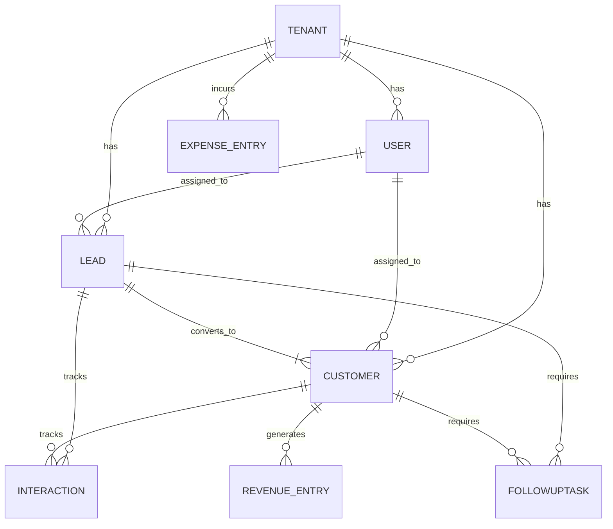

# Database Documentation

The database is built on PostgreSQL using Prisma ORM. It implements a multi-tenant architecture, meaning every record belongs to a specific `tenant_id`.

## Entity Relationship Diagram (ERD)

## Models

### 1. Tenant
- **Purpose:** Represents a single business organization using the CRM.
- **Fields:** `id` (UUID), `name`, `industry`, `status`, `created_at`.
- **Relationships:** Has many Users, Leads, Customers, Revenues, Expenses.

### 2. User
- **Purpose:** An employee or admin who logs in.
- **Fields:** `id`, `tenant_id`, `email`, `password_hash`, `role` (ADMIN, STAFF).
- **Relationships:** Belongs to Tenant. Can be assigned to Leads and Customers.

### 3. Lead
- **Purpose:** A potential customer in the pipeline.
- **Fields:** `id`, `tenant_id`, `first_name`, `last_name`, `email`, `phone_number`, `status` (NEW, CONTACTED, WON, etc.).
- **Relationships:** Can be converted to a Customer. Has many Interactions and Tasks.

### 4. Customer
- **Purpose:** A paying client.
- **Fields:** `id`, `tenant_id`, `company`, `total_revenue`, `email`, `phone_number`.
- **Relationships:** Has many Revenue Entries, Interactions, and Tasks.

### 5. Interaction (Notes)
- **Purpose:** A timeline log (Note, Call, Email).
- **Fields:** `id`, `type`, `notes`, `created_at`.
- **Relationships:** Linked optionally to a `lead_id` OR `customer_id`.

### 6. FollowUpTask
- **Purpose:** A scheduled task.
- **Fields:** `id`, `title`, `due_date`, `status`, `priority`.
- **Relationships:** Assigned to a User. Linked to a `lead_id` OR `customer_id`.

### 7. RevenueEntry
- **Purpose:** Income log.
- **Fields:** `id`, `amount`, `description`, `date`.
- **Relationships:** Linked to a Customer and Tenant.

### 8. ExpenseEntry
- **Purpose:** Outgoing cost log.
- **Fields:** `id`, `category`, `amount`, `description`, `date`.
- **Relationships:** Linked to Tenant globally.
