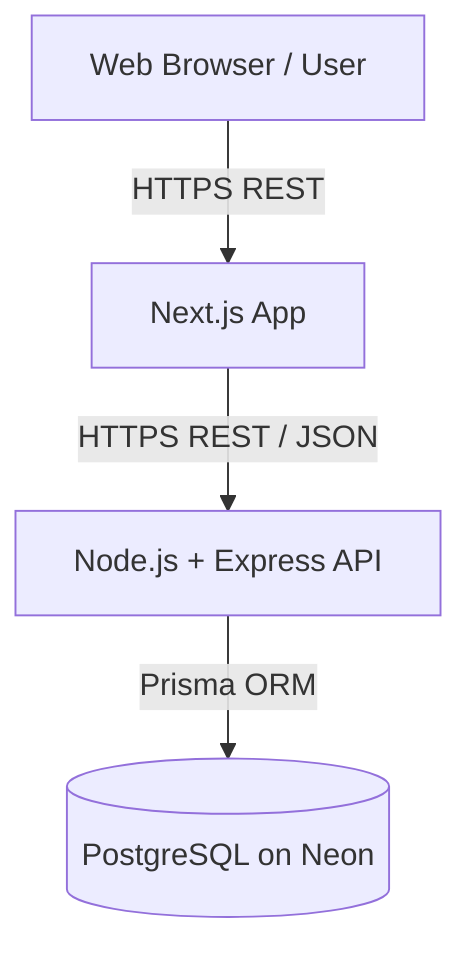
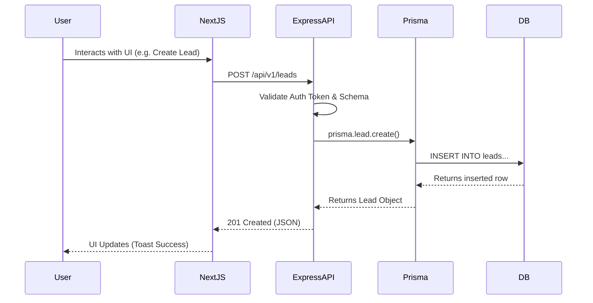

# System Architecture

The SaaS CRM is built on a modern decoupled architecture separating the presentation layer (Frontend) from the business logic layer (Backend), communicating via REST APIs.

## Technology Stack

- **Frontend:** Next.js (App Router), React, TypeScript, Tailwind CSS, ShadCN UI, Framer Motion, React Query.
- **Backend:** Node.js, Express.js, Prisma ORM, JSON Web Tokens (JWT).
- **Database:** PostgreSQL (hosted on Neon).
- **Deployment:** Vercel (Frontend), Render (Backend).

## High-Level Architecture

## Data Flow Diagram

## Folder Structure

### Frontend (`/frontend`)
- `/src/app`: Next.js App Router pages and layouts (`/login`, `/(dashboard)`).
- `/src/components`: Reusable UI elements (ShadCN components, layout components).
- `/src/features`: Domain-driven component separation (e.g., `leads/`, `customers/`, `financial/`).
- `/src/hooks`: Custom React hooks (e.g., `useAuth`).
- `/src/lib`: Utility functions (e.g., `axios.ts`, `utils.ts`).
- `/src/services`: API wrappers wrapping Axios calls.

### Backend (`/server`)
- `/src/controllers`: Request handlers. Parses input, calls services, sends HTTP response.
- `/src/services`: Core business logic and Prisma database interactions.
- `/src/routes`: Express router definitions.
- `/src/middlewares`: Auth guards, error handlers, and Zod validation middleware.
- `/src/validations`: Zod schema definitions for API input.
- `/prisma`: Prisma schema (`schema.prisma`) and migrations.
